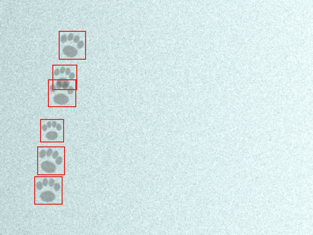
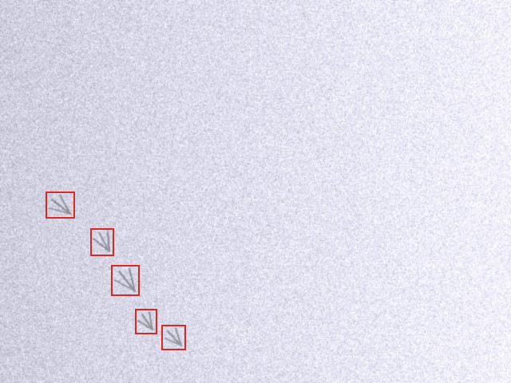
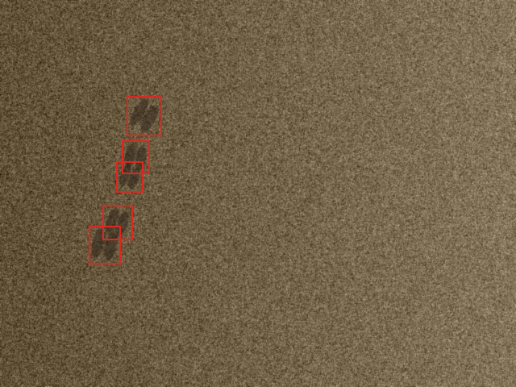
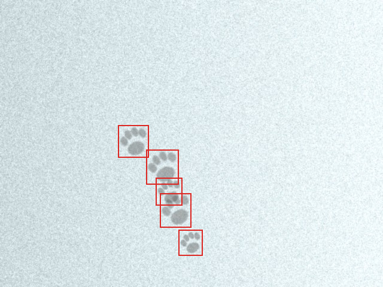
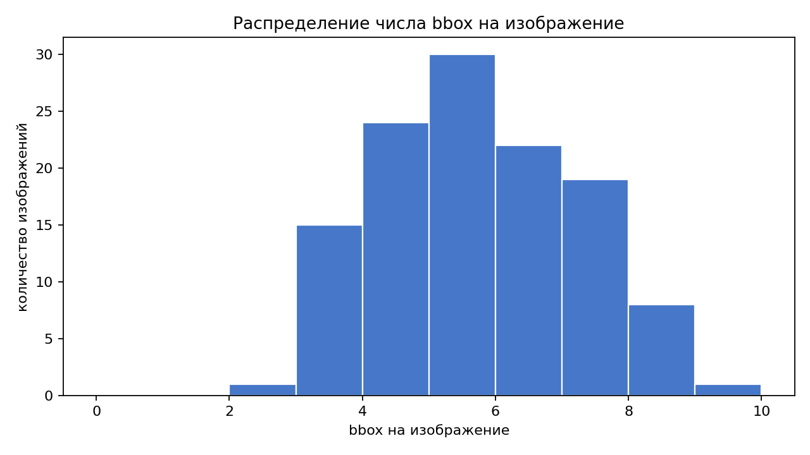
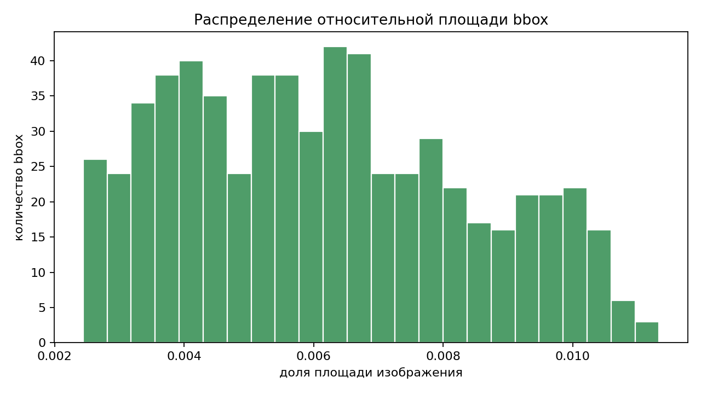

# Детекция следов диких животных на фотографиях

Курсовая работа по дисциплине «Сбор, генерация и разметка данных». Цель разметки — подготовить калибровочный датасет для задачи object detection: на изображении нужно найти следы животных и описать каждый видимый объект прямоугольной рамкой.

## Состав проекта

```text
course_project/
├── README.md
├── docker-compose.yml
├── annotations/
│   ├── label_studio_export.json
│   └── yolo/
├── data/
│   ├── images/
│   ├── obj.names
│   ├── sources.csv
│   └── stats.json
├── docs/
│   ├── annotator_guide.md
│   └── assets/
├── label_studio/
│   ├── label_config.xml
│   └── tasks.json
└── scripts/
```

## Датасет

В текущей сборке подготовлена воспроизводимая учебная калибровочная выборка из 120 изображений. Изображения сгенерированы локальным процедурным генератором как фото-подобные сцены со следами на снегу, песке и грязи. Это было сделано как fallback: прямой сбор 120 реальных изображений из Wikimedia Commons в текущем окружении начал стабильно возвращать `429 Too Many Requests`; загрузчик Wikimedia сохранён в `scripts/download_wikimedia_dataset.py` и может быть использован при доступном канале без rate-limit.

Основная разметка хранится в двух форматах:

- Label Studio JSON: `annotations/label_studio_export.json`;
- YOLO TXT: `annotations/yolo/*.txt`.

Статистика текущей выборки:

| Показатель | Значение |
|---|---:|
| Изображений | 120 |
| BBox | 631 |
| Пустых изображений | 0 |
| Среднее bbox на изображение | 5.258 |
| Медиана bbox на изображение | 5.0 |
| Средняя относительная площадь bbox | 0.006168 |

## Формат разметки

Используется один класс:

```text
animal_track
```

Файл `data/obj.names` содержит имя класса, а каждая строка YOLO-разметки имеет вид:

```text
0 <x_center> <y_center> <width> <height>
```

Координаты нормированы на ширину и высоту изображения. В Label Studio используется `RectangleLabels`:

```xml
<View>
  <Image name="image" value="$image"/>
  <RectangleLabels name="label" toName="image">
    <Label value="animal_track"/>
  </RectangleLabels>
</View>
```

## Правила разметки

Разметчик ставит bbox вокруг каждого уверенно различимого отпечатка или компактной группы отпечатков, если отдельные следы сливаются. Рамка должна идти по внешним границам видимой части следа; допустимое отклонение — 2–5 пикселей. Нельзя обрезать значимые части следа и нельзя включать лишние элементы фона без необходимости.

Если след частично перекрыт снегом, грязью, тенью или границей кадра, размечается только видимая часть. Пересекающиеся следы размечаются отдельными рамками без искусственного расширения на соседний объект.

Полная инструкция находится в `docs/annotator_guide.md`.

## Label Studio

Запуск:

```bash
cd course_project
docker compose up
```

После запуска интерфейс доступен на `http://localhost:8080`.

Порядок работы:

1. Создать проект в Label Studio.
2. Вставить конфигурацию из `label_studio/label_config.xml`.
3. Импортировать задачи из `label_studio/tasks.json`.
4. При необходимости импортировать готовый экспорт `annotations/label_studio_export.json` или проверить/исправить bbox вручную.

В `docker-compose.yml` включена локальная раздача файлов из `data/images`.

## Примеры разметки









## Графики





## Воспроизведение

Сгенерировать текущий калибровочный набор и все артефакты:

```bash
python scripts/generate_synthetic_tracks_dataset.py
python scripts/generate_dataset_artifacts.py
python scripts/validate_dataset.py
```

Попробовать сбор реальных изображений из Wikimedia Commons:

```bash
python scripts/download_wikimedia_dataset.py
python scripts/generate_dataset_artifacts.py
python scripts/validate_dataset.py
```

Если Wikimedia снова отдаёт `429`, нужно снизить частоту загрузки или запустить сбор позже.

## Проверка

Валидатор проверяет:

- ровно 120 изображений;
- соответствие `sources.csv` списку изображений;
- открываемость всех JPEG через PIL;
- наличие `tasks.json` и Label Studio export на 120 задач;
- наличие YOLO-файла для каждого изображения;
- корректность YOLO-строк и диапазон координат `[0, 1]`;
- наличие preview-изображений с bbox.

